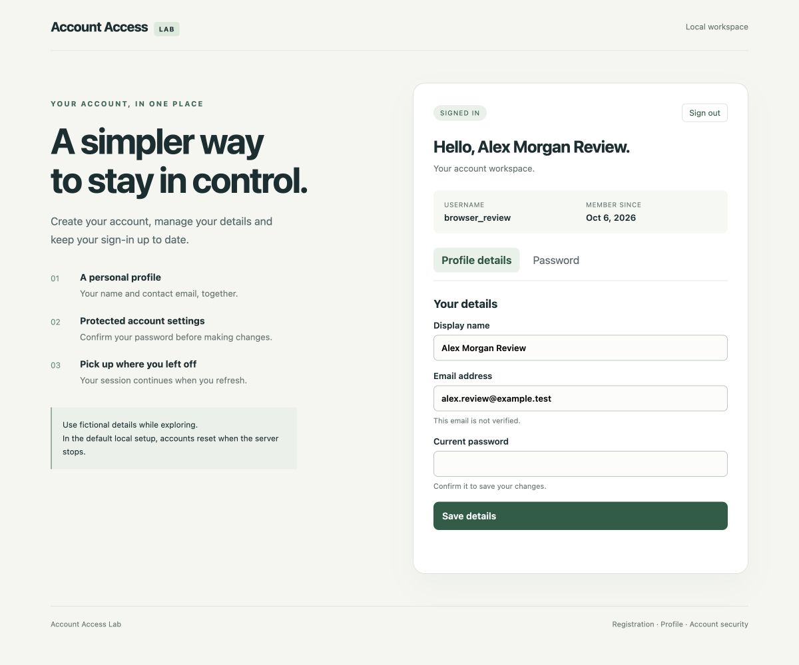
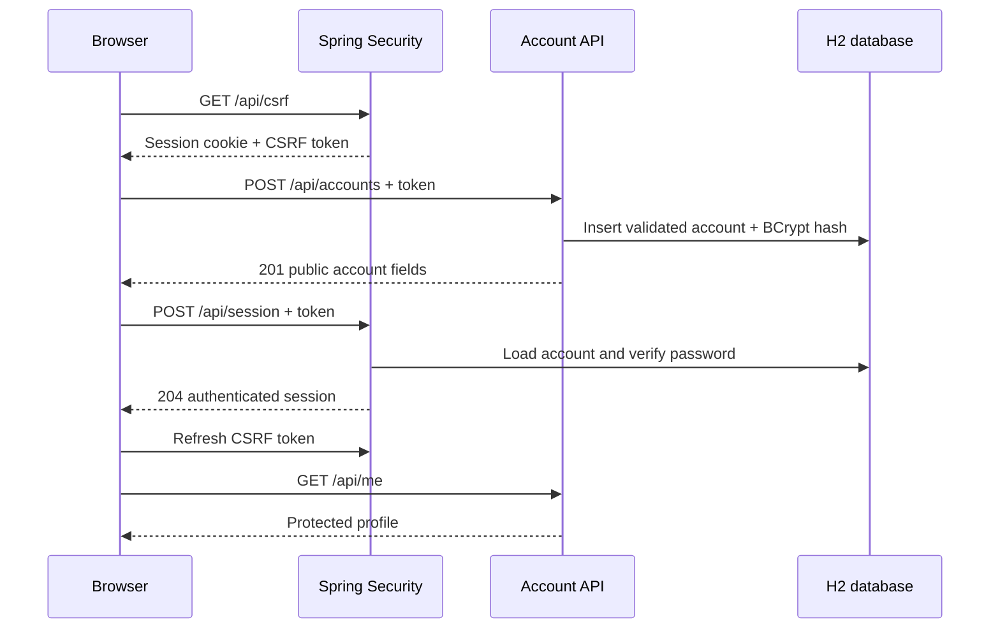

# Account Access Lab

[](https://github.com/Sevyn1/account-access-lab/actions/workflows/verify.yml)

A consolidated Java account application with registration, session-based sign-in, private profile editing and password changes. It brings the Spring Registration learning workflows into one maintained application with a redesigned browser interface. Developed and reviewed in October 2026.

**Java 17 · Spring Boot · Spring Security · JDBC · Flyway · H2 · JavaScript**



## Try it locally

Requires Java 17. The Maven wrapper downloads Maven and dependencies on its first run.

```sh
./mvnw spring-boot:run
```

Open **http://127.0.0.1:8084/**. Create an account with fictional details, sign in, edit your name and email with password confirmation, change your password, then sign in again and sign out. Windows users can use `mvnw.cmd`.

The default local H2 database starts empty and is discarded when the process stops. To retain fictional accounts between restarts, run `java -jar target/account-access-lab-1.0.0.jar --spring.profiles.active=persistent`. This stores an H2 database in the gitignored `data/` folder; browser sessions still end on restart. The server binds to loopback; no hosted service or real user data is required.

```sh
./mvnw verify
java -jar target/account-access-lab-1.0.0.jar
```

## What the project demonstrates

- Validation at the API boundary: constrained usernames, display names, email addresses and password lengths.
- A versioned SQL schema and parameterized queries, with the username primary key preventing duplicate registration even under concurrent requests.
- BCrypt password storage; registration responses exclude email and password hashes; the authenticated profile includes only that account’s contact email.
- Session authentication using Spring Security, with CSRF tokens for every state-changing request.
- Protected profile read/edit endpoints and password-confirmed settings. Password updates end the current session; other existing sessions are not revoked. Old passwords fail subsequent sign-in.
- Generic login failures and no-store responses for session tokens and profile data.
- A second Flyway migration adds email without rewriting the original schema or deleting older accounts. Older accounts can add their email from Profile details.
- A responsive JavaScript interface with confirmation checks, submission guards, session-token refresh and useful error feedback. Account fields are rendered with `textContent`.
- Integration tests that exercise security filters, controllers, database migrations and SQL together.

## Request flow



## API

| Method | Route | Behavior |
| --- | --- | --- |
| GET | `/api/csrf` | Issue a session-bound CSRF token and its header name |
| POST | `/api/accounts` | JSON: `username`, `displayName`, `email`, `password`; returns 201, 400 or 409 |
| POST | `/api/session` | Form-encoded username/password; returns 204 or generic 401 |
| GET | `/api/me` | Current account; returns 401 without authentication |
| PATCH | `/api/me` | Update own `displayName` and `email`, confirming `currentPassword` |
| POST | `/api/me/password` | Confirm `currentPassword`, set `newPassword`, end current session |
| POST | `/api/session/logout` | Invalidate the session; returns 204 |

POST and PATCH requests require the CSRF header and session cookie. Fetch a new token after login/logout. The browser implements this flow in [app.js](src/main/resources/static/app.js).

Usernames use 3–24 letters, numbers or underscores and are normalized to lowercase. Passwords use 12–72 characters and must also fit within BCrypt's 72-byte UTF-8 limit.

## Verification and design

[Verification](docs/VERIFICATION.md) records tested behavior. [Design decisions](docs/DESIGN.md) explains the session, SQL and browser choices. [Interview review](docs/INTERVIEW_REVIEW.md) provides topics to study and discuss honestly.

## Scope

This is a local learning demo. It has no account recovery, email verification, MFA, login throttling, production database configuration, monitoring or production deployment. A deployed identity service would need these decisions plus HTTPS, secure cookies, secrets management and a dedicated security review. H2 tests do not establish PostgreSQL compatibility.

## Authorship and licensing

The application implementation was newly written from a registration/login functional specification and extended for consolidation. [Consolidation provenance](docs/CONSOLIDATION.md) records the reviewed workflows and repository status. It does not include the recovered shared repository's application source, templates, styles, configurations or Git history. AI assistance was used for implementation, tests, documentation and verification; it is not presented as prior professional employment or entirely unaided work.

The project source is MIT licensed. Maven wrapper scripts retain Apache Software Foundation notices and use Apache-2.0 licensing; see [third-party notices](THIRD_PARTY_NOTICES.md). Spring and other dependencies retain their own licenses.
