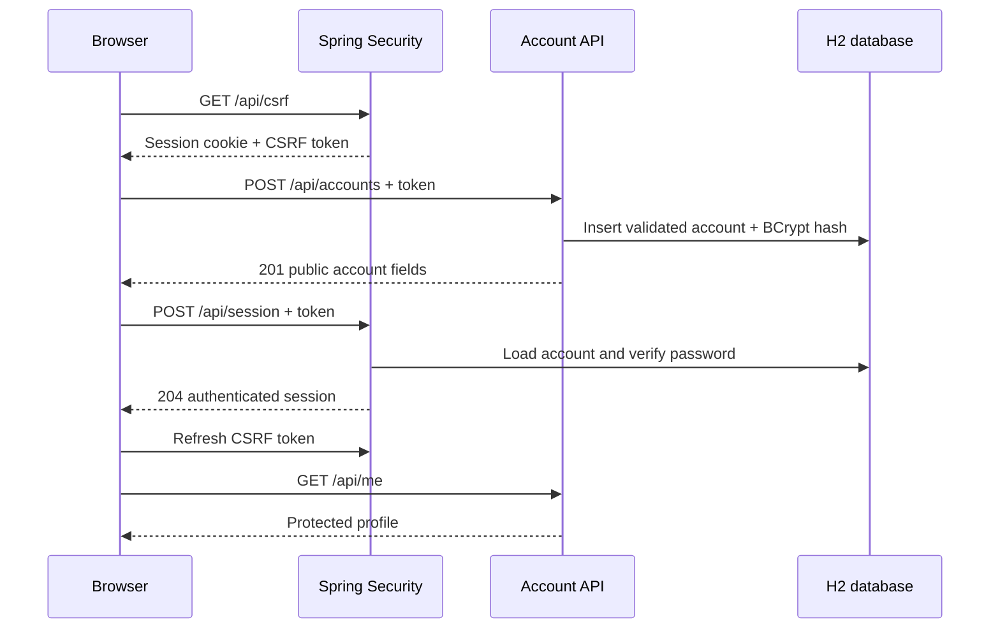

# Account Access Lab

[](https://github.com/Sevyn1/account-access-lab/actions/workflows/verify.yml)

A Java account system with a browser interface, validated registration and session-based authentication. Built as a focused engineering learning project with Codex assistance in October 2026.

**Java 17 · Spring Boot · Spring Security · JDBC · Flyway · H2 · JavaScript**


## Try it locally

Requires Java 17. The Maven wrapper downloads Maven and dependencies on its first run.

```sh
./mvnw spring-boot:run
```

Open **http://127.0.0.1:8084/**. Create an account with fictional details, sign in, inspect the protected profile, then sign out. Windows users can use `mvnw.cmd`.

The local H2 database starts empty and is discarded when the process stops. The server binds to loopback; no hosted service or real user data is required.

```sh
./mvnw verify
java -jar target/account-access-lab-1.0.0.jar
```

## What the project demonstrates

- Validation at the API boundary: constrained usernames, display names and password lengths.
- A versioned SQL schema and parameterized queries, with the username primary key preventing duplicate registration even under concurrent requests.
- BCrypt password storage; API responses contain only public account fields.
- Session authentication using Spring Security, with CSRF tokens for every state-changing request.
- A protected profile endpoint, generic login failures, and no-store responses for session tokens and profile data.
- A responsive JavaScript interface with confirmation checks, submission guards, session-token refresh and useful error feedback. Account fields are rendered with `textContent`.
- Integration tests that exercise security filters, controllers, database migrations and SQL together.

## Request flow



## API

| Method | Route | Behavior |
| --- | --- | --- |
| GET | `/api/csrf` | Issue a session-bound CSRF token and its header name |
| POST | `/api/accounts` | JSON: `username`, `displayName`, `password`; returns 201, 400 or 409 |
| POST | `/api/session` | Form-encoded username/password; returns 204 or generic 401 |
| GET | `/api/me` | Current account; returns 401 without authentication |
| POST | `/api/session/logout` | Invalidate the session; returns 204 |

POST requests require the CSRF header and session cookie. Fetch a new token after login/logout. The browser implements this flow in [app.js](src/main/resources/static/app.js).

Usernames use 3–24 letters, numbers or underscores and are normalized to lowercase. Passwords use 12–72 characters and must also fit within BCrypt's 72-byte UTF-8 limit.

## Verification and design

[Verification](docs/VERIFICATION.md) records tested behavior. [Design decisions](docs/DESIGN.md) explains the session, SQL and browser choices. [Interview review](docs/INTERVIEW_REVIEW.md) provides topics to study and discuss honestly.

## Scope

This is a local learning demo. It has no account recovery, email verification, MFA, login throttling, persistent production database, monitoring or production deployment. A deployed identity service would need these decisions plus HTTPS, secure cookies, secrets management and a dedicated security review. H2 tests do not establish PostgreSQL compatibility.

## Authorship and licensing

The application implementation was newly written for this project from a registration/login functional specification. It does not include the recovered shared repository's application source, templates, styles, configurations or Git history. AI assistance was used for implementation, tests, documentation and verification; it is not presented as prior professional employment or entirely unaided work.

The project source is MIT licensed. Maven wrapper scripts retain Apache Software Foundation notices and use Apache-2.0 licensing; see [third-party notices](THIRD_PARTY_NOTICES.md). Spring and other dependencies retain their own licenses.
